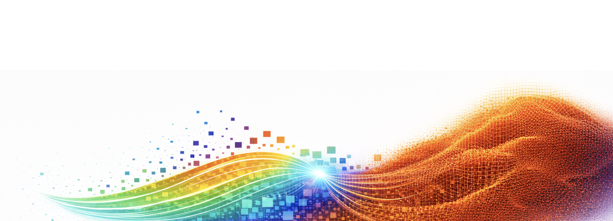
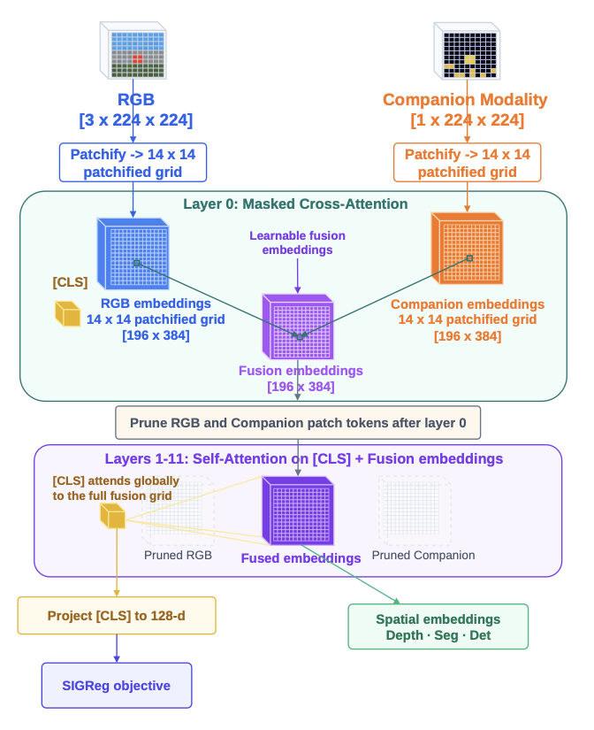
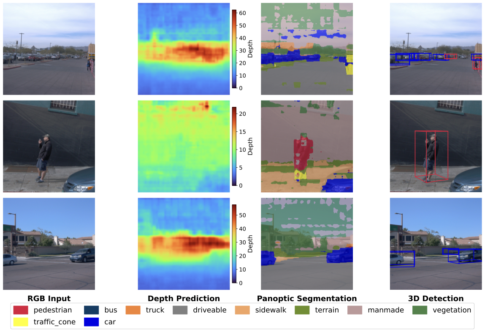

<div align="center">



# Le MuMo JEPA

### Multi-Modal Self-Supervised Representation Learning with Learnable Fusion Tokens

[](https://arxiv.org/abs/2603.24327)
[](LICENSE)
[](https://www.python.org/)
[](https://pytorch.org/)

[**Paper**](https://arxiv.org/abs/2603.24327) | [**Website**](https://ciemcornelissen.github.io/)

</div>

---

Official code for **"Le MuMo JEPA: Multi-Modal Self-Supervised Representation Learning with Learnable Fusion Tokens"**, accepted at the **CVPR 2026 Workshop on Unified Robotic Vision with Cross-Modal Sensing and Alignment (URVIS)**.

## Overview

Le MuMo JEPA is a self-supervised framework that learns unified representations from RGB images and aligned companion modalities (e.g., camera-aligned LiDAR depth, thermal). It extends [LeJEPA](https://arxiv.org/abs/2511.08544) to the multi-modal setting by introducing **learnable fusion tokens** that act as a latent bottleneck between modality-specific patch stems inside a shared Vision Transformer.

Key features:
- **Learnable fusion tokens** — a set of tokens equal in number to the spatial patches that aggregate information from spatially corresponding RGB and companion-modality patches through cross-attention.
- **Pruned fusion** (default) — after the initial cross-modal attention layer, modality-specific tokens are dropped, forcing cross-modal information into the shared fusion-token grid. This reduces attention cost by ~9x while preserving representation quality.
- **SIGReg objective** — Sketched Isotropic Gaussian Regularization applied to the joint multimodal CLS embedding, without requiring stop-gradients or teacher-student networks.

<div align="center">

<br>
<em>Figure: Overview of Le MuMo JEPA. The companion modality is fused with RGB through learnable fusion tokens that act as a latent bottleneck inside a shared transformer.</em>
</div>

## Qualitative Results

Le MuMo JEPA produces rich spatial representations that support multiple downstream tasks through frozen patch probes, including dense depth estimation, semantic segmentation, and CenterNet-style 3D object detection.

<div align="center">

<br>
<em>Qualitative probe outputs from a frozen Le MuMo JEPA encoder: RGB input, depth prediction, panoptic segmentation, and 3D detection.</em>
</div>

## Installation

```bash
git clone https://github.com/ciemcornelissen/le-mumo-jepa.git
cd le-mumo-jepa
pip install -r requirements.txt
```

`requirements.txt` covers the core paper training path. Optional ablations such as ImageBind, Sinkhorn/GeomLoss, and THOP profiling require extra dependencies or weights.

## Usage

### Self-Supervised Pretraining

```bash
# Waymo (RGB + LiDAR depth)
python train.py \
    +dataset=waymo \
    +waymo_dataroot=/path/to/waymo_data \
    +arch=C \
    +fusion_tokens_sigreg=true \
    +fusion_tokens_variant=prune_after_first \
    +aligned_mode=true \
    +lidar_mode=depth \
    +lamb=0.1 \
    +V=2 \
    +proj_dim=128 \
    +lr=1e-4 \
    +bs=64 \
    +epochs=5

# nuScenes (RGB + LiDAR depth)
python train.py \
    +dataroot=/path/to/nuscenes_data \
    +dataset=nuscenes \
    +arch=C \
    +fusion_tokens_sigreg=true \
    +fusion_tokens_variant=prune_after_first \
    +aligned_mode=true \
    +lidar_mode=depth \
    +lamb=0.1 \
    +V=2 \
    +proj_dim=128 \
    +lr=1e-4 \
    +bs=64 \
    +epochs=5

# FLIR ADAS (RGB + Thermal)
python train.py \
    +dataset=flir \
    +flir_dataroot=/path/to/flir_adas_v2 \
    +arch=C \
    +fusion_tokens_sigreg=true \
    +fusion_tokens_variant=prune_after_first \
    +lidar_mode=depth \
    +lamb=0.1 \
    +epochs=20
```

### Fine-tuning

```bash
python finetune.py \
    --checkpoint /path/to/pretrained.pth \
    --dataset flir \
    --flir_dataroot /path/to/flir_adas_v2 \
    --epochs 30 \
    --encoder_lr 2e-5 \
    --decoder_lr 1e-4
```

### Configuration
Default training configuration is in [`configs/default.yaml`](configs/default.yaml). The checked-in defaults match the paper-style pruned fusion-token setup. Key hyperparameters:

| Parameter | Default | Description |
|-----------|---------|-------------|
| `arch` | `C` | Base architecture family used for fusion-token training |
| `fusion_tokens_sigreg` | `true` | Enables the learnable fusion-token Le MuMo JEPA variant |
| `fusion_tokens_variant` | `prune_after_first` | Pruned fusion-token routing used in the paper |
| `aligned_mode` | `true` | Uses a 1-channel aligned companion modality input |
| `lidar_mode` | `depth` | Uses aligned depth-style inputs instead of 5-channel range images |
| `lamb` | `0.1` | SIGReg trade-off weight |
| `V` | `2` | Number of global crops |
| `local_crops_number` | `4` | Number of local crops |
| `proj_dim` | `128` | Projection dimension for SIGReg |
| `bs` | `32` | Batch size |
| `lr` | `0.002` | Learning rate |
| `epochs` | `10` | Number of training epochs |

## Repository Structure

```
le-mumo-jepa/
├── train.py                        # Main SSL pretraining script
├── finetune.py                     # Downstream fine-tuning / evaluation script
├── configs/
│   └── default.yaml                # Default training configuration
├── src/
│   ├── encoder.py                  # Multi-modal encoders (including MMEncoderC_FusionTokens)
│   ├── losses.py                   # Baseline losses (VICReg, InfoNCE)
│   ├── baseline_encoders.py        # Baseline encoders (DINOv3, ImageBind, MultiMAE)
│   ├── novel_regularizers.py       # Additional regularizers (GMM, Sinkhorn, Spectral)
│   ├── dataset.py                  # Multi-modal dataset (nuScenes)
│   ├── waymo_dataset.py            # Waymo dataset
│   ├── flir_dataset.py             # FLIR ADAS dataset
│   ├── lidar_utils.py              # LiDAR processing utilities
│   ├── lidar_augmentations.py      # LiDAR augmentation pipeline
│   ├── detection_probes.py         # Frozen patch probes (CenterNet, depth, segmentation)
│   ├── detection_labels.py         # Detection label processing
│   └── detection_integration.py    # Detection pipeline integration
├── assets/                         # Figures for README
├── requirements.txt
└── LICENSE
```

## Citation

If you find this work useful, please cite our paper:

```bibtex
@inproceedings{cornelissen2026lemumojepa,
    title     = {Le MuMo JEPA: Multi-Modal Self-Supervised Representation Learning with Learnable Fusion Tokens},
    author    = {Cornelissen, Ciem and Leroux, Sam and Simoens, Pieter},
    booktitle = {CVPR 2026 Workshop on Unified Robotic Vision with Cross-Modal Sensing and Alignment (URVIS)},
    year      = {2026},
    note      = {arXiv:2603.24327}
}
```

## License

This project is licensed under the [Apache License 2.0](LICENSE). If you use this code in your research, please cite our paper.

## Acknowledgments

This work received financial support from the [Flanders AI Research Program (FAIR)](https://www.flandersairesearch.be/).

**Authors:** [Ciem Cornelissen](https://ciemcornelissen.github.io/), Sam Leroux, Pieter Simoens — IDLab, Department of Information Technology, Ghent University – imec, Belgium.
